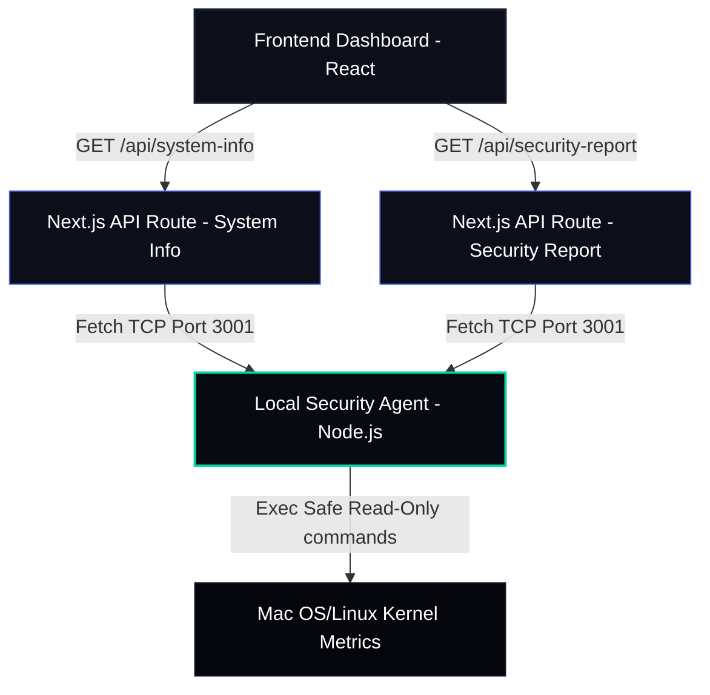

# OS Kernel Security Testing Platform — Safe Defensive Monitoring Prototype

Welcome to the **OS Kernel Security Testing Platform (KSTP)**. This is a premium, information-dense, educational cybersecurity dashboard built using **Next.js, React, Tailwind CSS, and Framer Motion**. 

It is designed to serve as an outstanding **university project presentation** and **internship portfolio piece**, showcasing modern system telemetry, endpoint monitoring agents, and defensive risk scoring systems.

---

> [!IMPORTANT]
> **Safety & Regulatory Disclaimer**
> This project is a **safe defensive monitoring prototype**. It does **NOT** perform real kernel exploitation, memory corruption injections, privilege escalation, malware behavior, stress testing, or any destructive commands. All system audits are strictly **read-only** and execute as a standard user with no administrative privileges (`sudo`) required.

---

## 🛠️ System Architecture

The project runs on a modern decoupled architecture simulating real endpoint security suites (such as *CrowdStrike Falcon* or *OSquery*):



---

## ✨ Features

### 1. Dual-Mode Telemetry Checkers
* **Real Safe Check**: Pings the local agent running on your Mac/Linux. If connected, the dashboard retrieves and renders your actual host configurations, kernel version, hostname, and active running metrics.
* **Simulation Scan**: A weighted random probability mock engine (50% Passed, 30% Warnings, 20% Failures) that demonstrates advisory telemetry states—perfect for offline presentations or showcasing critical risk outcomes.

### 2. Local Endpoint Agent (`agent/local-agent.js`)
A lightweight, zero-dependency background monitor using Node's native `http` and `os` libraries that runs safe read-only standard commands:
* **OS Details**: `sw_vers` (macOS) or `/etc/os-release` (Linux).
* **Kernel version**: `uname -r`.
* **System Uptime**: `os.uptime()`.
* **Process Density count**: `ps -ax | wc -l`.
* **Ingress Socket count**: `lsof -i -P -n -sTCP:LISTEN | wc -l`.
* **Firewall Preferences**: `defaults read /Library/Preferences/com.apple.alf globalstate` (macOS read-only preferences check).
* **Loaded Kernel Modules**: `kextstat` (macOS) or `lsmod` (Linux).

### 3. Smart Risk Calculation Algorithm
Next.js API routes run a real-time defensive score calculation:
* Start with a base of **100 points**.
* Deduct **10 points** for each *Advisory/Warning* condition (high process load, unsupported firewall settings).
* Deduct **25 points** for each *Failed/Critical* condition (disabled firewall, excessive listening sockets).
* Map output risk state:
  * **80 - 100**: Low Risk (System nominal, Clear)
  * **50 - 79**: Medium Risk (System review required, Alert)
  * **Below 50**: High Risk (Critical incident response, Action Needed)

---

## 🔍 What is Real vs. Simulated?

| Subsystem / Metric | Real Status | Technical Explanation |
| :--- | :---: | :--- |
| **Next.js & Frontend Design** | **100% REAL** | Clean, responsive Tailwind CSS structure with Framer Motion spring physics. |
| **System Info Telemetry** | **100% REAL** | OS, Kernel Version, RAM usage, Cores, and Uptime are queried directly from your Mac. |
| **Defensive Port & Process Checks** | **100% REAL** | Process counts and ingress TCP listener sockets are actively calculated via standard read-only commands. |
| **Application Firewall Status** | **100% REAL** | Retrieves preference keys from macOS settings to verify whether your firewall is enabled. |
| **Threat Scoring & Matrix Logs** | **100% REAL** | Points deductions and scoring categorizations run actively on Javascript API modules. |
| **Storage & Update Compliance** | *SIMULATED* | Placeholders showing standard policy recommendations (e.g. recommending FileVault / standard patches). |

---

## 📂 Quick Start & Installation

Ensure you have [Node.js](https://nodejs.org/) installed (v18+ recommended).

### 1. Install Dependencies
Open the project directory in your terminal and run:
```bash
npm install
```

### 2. Start Both Web App & Endpoint Agent Simultaneously
You only need to run a single command in your terminal:
```bash
npm run dev
```

This launches **both** the Next.js development server (port 3000) and the read-only security agent (port 3001) in parallel using the `concurrently` package! 

You will see color-coded logging in a single terminal tab:
* `[AGENT]` logs in **cyan** (the background monitor)
* `[NEXT]` logs in **blue** (the web application and backend API routes)

### 3. Open the Dashboard
Open [http://localhost:3000](http://localhost:3000) in your web browser. 

Click **"Run Real Safe Check"** on the dashboard. The status badge will display **Agent Connected**, your actual macOS specifications will load, and a real-time incident audit report will generate!


---

## ⚖️ Why Real Kernel Exploits Are Not Included
In enterprise security, defensive agents (like *Falcon* or *Wazuh*) and offensive testers do not run raw exploits on production machines. Real kernel exploitation (e.g., abusing use-after-free or buffer overflows in kernel memory) is:
1. **Destructive**: It causes unpredictable memory corruption that immediately triggers **kernel panics** (crashing your machine and potentially losing unsaved data).
2. **Environment-Dependent**: Exploits are heavily customized for exact minor patch numbers; running them on a standard development machine is highly likely to fail or freeze processes.
3. **Hazardous**: Running exploit payloads can compromise the host security, making it vulnerable to external attacks.

Therefore, this platform represents the **professional endpoint protection standard**—auditing system settings defensively to identify risks *before* they can be exploited.

---

## 🔮 Future Improvements & Portfolio Goals
To extend this defensive prototype even further for enterprise environments:
1. **Interactive Host Shell**: Introduce a safe read-only CLI emulator in the dashboard to execute customized safe system queries (e.g., querying hardware metrics).
2. **Dynamic Wazuh / OSquery Connectors**: Create actual connector plugins that pull live endpoint telemetry directly from structured OSquery databases.
3. **Multi-Agent Fleet Dashboard**: Expand the UI to support fleet monitoring, allowing a security analyst to switch between multiple host agents (`agent-01`, `agent-02`) connected via WebSockets.
4. **Active Policy Enforcement**: Implement local secure triggers (e.g., automatically enabling the macOS firewall via local instructions if a disabled status is audited).

